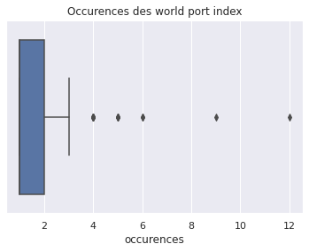
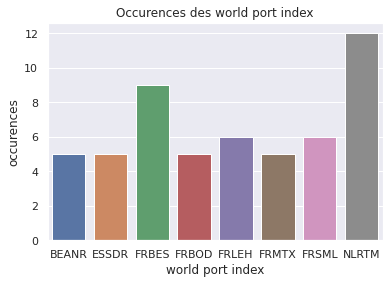

## Dataset
#### Problème du jeux de donnée initial

#### Solution: 10 ports
- Choix de 10 ports
- Auto-génération d'un jeux de donnée avec des expressions régulières

### Experiment Tracking

| id |  Tests | Train | Classifier | Recall @1 @2 @3 | 
| -- | ------ | ----- | ---------- | --------------- |
| test-1 | 10_ports | 10_ports | Regexp | 0, 0, 0 |
| test-2 | 10_ports | 10_ports | Naive Bayes (character-level) | 0, 0, 0 |
| test-2 | 10_ports | 10_ports | K-means (Damerau distance) | 0, 0, 0 |											