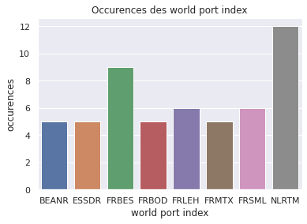

# Étude du jeux de données construit

## Introduction
Pour pouvoir se décider sur une stratégie, il est nécessaire de comprendre notre jeux de données et s'assurer de son homogénéité.

Notre problème est double:
1. Classifier les entrées selon les 4 catégories: FANCY, BON, ORTHOGRAPHE (faute d'orthographe), ABBREVIATION
2. Classifier les entrées parmi la liste des *world port index*

Dans l'idéal, il nous faudrait donc une bonne diversité pour ces 2 aspects, i.e beaucoup de données qui recouvrent une sous-liste des *world port index*, et pour chaque *world port index* une répartition équitable entre les 4 catégories d'entrées.

## Analyse des données
- Nous partons d'un jeux de données de **360 entrées**
- Les données recouvrent **226 ports différents**

- L'**occurence** de chaque *world port index* est comprise entre 1 et 12 seulement

- 70% des *world port index* n'apparaissent qu'une seule fois
- 86% des *world port index* apparaissent moins de 3 fois

Par exemple, les 9 entrées associées au port de Brest (FRBES) sont:
- BREST
- RADE DE BREST
- BREST PILOT
- BREST FRANCE
- BREST, FRANCE
- RADE BREST
- BESFR
- BRESTF.O.
- BRESTFR

## Conclusion
Plutôt que de recouvrir 226 ports de manière superficielle, il serait beaucoup plus intéressant de se focaliser sur n ports (n à définir) et s'assurer d'avoir une diversité homogène dans les entrées associées (réparti entre les 4 catégories d'entrées possibles).