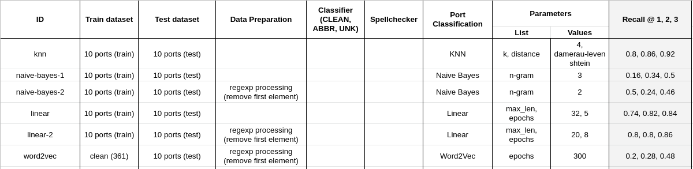

# Modèles

- [Problème](#problem)
- [Modèles](#modeles)
    * [Mesure de Performance](#mesure-de-performance)
    * [Word2Vec](#word2vec)
    * [Régression Logistique](#regression-logistique)
    * [Les plus proches voisins (KNN)](#les-plus-proches-voisins-knn)
    * [Naive Bayes et n-grammes](#naive-bayes-et-n-grammes)

## Table d'expérimentation

## Problème

Nous sommes face à un problème de classification (la classe est le *world port index*, par exemple **FRBES** pour **Brest**) avec des données textuelles.

En général, les modèles d'apprentissage prennent uniquement des données numériques en entrée. Il est donc nécessaire d'*encoder* nos entrées textuelles, i.e définir une représentation numérique d'une chaîne de caractères.

Nous utilisons ici le principe de *vocabulaire*. Un *vocabulaire* est une manière d'associer une chaîne de caractère à un entier (un indice), en général de manière incrémentale. Nous avons le choix entre 2 méthodes:
- à chaque mot est associé un entier (ex: `Brest = 1`, `France = 2`, etc)
- à chaque lettre est associé un entier (ex: `a = 1`, `b = 2`, etc)

## Modèles
Pour chacun des modèles implémentés, nous verrons l'optimisation des paramètres, la performance, les avantages et les inconvénients.

#### Mesure de Performance

La métrique choisis pour comparer et évaluer les différents modèles est le **Recall @k**.
Étant donné une entrée (par exemple Brest), nos modèles retournent la liste complète des classes possibles avec une valeur qui correspond à la probabilité que cette classe soit la bonne:

$$\{
    FRBES: 0.7,
    NLRTM: 0.09,
    FRBOD: 0.12,
    ...
\}$$

Le **recall @1** consiste à regarder si la classe avec la plus grande valeur correspond effectivement à la bonne classe, puis comptabiliser les bonnes réponses:

$$ recall@1 = \frac{nombre \, de \, correctes}{nombre \, de \, données} $$

Le **recall @2** consiste à regarder si le bon port est parmi les 2 classes qui possèdent les plus grandes valeurs.

Enfin, le **recall @3** consiste à regarder si le bon port est parmi les 3 classes qui possèdent les plus grandes valeurs.

#### Word2Vec

Ici nous utilisons un encodage dont le vocabulaire est construit avec une liste de mots rencontrés dans le jeux de données d'entraînement.

##### Augmentation des données: KeyAug

Nous voyons que le modèle n'a aucune faculté de généralisation sur des mots non rencontrés au temps d'entrainement.
Nous nous sommes dit qu'en incorporant des fautes d'orthographes nous pourrions rendre le modèle plus robuste, en espérant qu'il apprenne à gérer ces fautes (ex: `ST PETERSBOURG == ST PETERSBURG`)

Finalement, on voit que l'augmentation des données à un effet desastreux. Le modèle ne parvient plus à classer même les mots vu à l'entrainement.

##### Bilan

Nous sommes passé à côté d'une dimension du problème: l'absence de vocabulaire. Une part du challenge est dans l'absence d'un vocabulaire, soit à cause d'abréviation non référencées soit à cause de fautes d'orthographes.
Nos prochaines méthodes feront donc usage d'un vocabulaire constitué de caractères et non de mots.

#### Régression Logistique

##### Hyperparamètres

Choix:
- epochs: 10
- learning rate: 0.1
##### Résultats
- Recall@1: 0.76
- Recall@2: 0.8
- Recall@3: 0.82

#### Les plus proches voisins (KNN)

##### Algorithme
- Entrainement: sauvegarder le jeux de données d'entrainement
- Prédiction: trouver les k plus proches voisins (parmi les données labellisées sauvegardées) de l'entrée. Nous attribuons la classe la plus présente parmi les voisins.

##### Paramètres

On choisis donc `k=4` plus proches voisins.

##### Résultats
- Recall@1: 0.8
- Recall@2: 0.9
- Recall@3: 0.94

#### Naive Bayes et n-grammes

Un n-gram est simplement une manière de glisser une fenêtre de taille fixée pour extraire une sous-chaîne de caractères:

La méthode générative de Bayes consiste à tirer parti de la formule de Bayes:

$$
\mathbb P(Y=y | X=x) = 
\frac{\mathbb P(X = x | Y= y) \mathbb P(Y=y)}{\mathbb P(X=x)}
$$
où $X$ est un n-gramme et $Y$ la classe.

À l'entrainement, le modèle apprend les termes $\mathbb P(X = x | Y= y)$ et $\mathbb P(Y=y)$:

$$
\mathbb P(X = x | Y= y) = \frac{nb \, d'occurence \, de \, x \, dans \, y}{nb \, d'apparition \, de \, y}
$$
$$
\mathbb P(Y= y) = \frac{nb \, d'apparation \, de \, y}{nb \, de \, données}
$$

Ainsi, pour prédire une classe, il suffit de réutiliser les probabilités estimées de tous les n-grammes:

$$
\mathbb P(Y=y | X) = \prod_{x}
\frac{\mathbb P(X = x | Y= y) \mathbb P(Y=y)}{\mathbb P(X=x)}
$$

Le problème est que si un des n-gramme est présent dans l'entrée mais qu'il n'a pas été vu à l'entrainement 
$$\mathbb P(X = x | Y= y)=0$$

et donc 

$$
\mathbb P(Y=y | X) = \prod_{x}
\frac{\mathbb P(X = x | Y= y) \mathbb P(Y=y)}{\mathbb P(X=x)} = 0
$$

Pour résoudre ce problème, nous utilisons *le lissage de Laplace* qui consiste à initier toutes les probabilités de $X$ à 1.

#### Paramètres

On choisis donc d'utiliser des **ngrams de taille 2**.

#### Résultats
*Les valeurs sont érronées. On voit sur le graphique en haut que Recall@1 devrait être égal à 0.5.*

- Recall@1: 0.24
- Recall@2: 0.26
- Recall@3: 0.42
